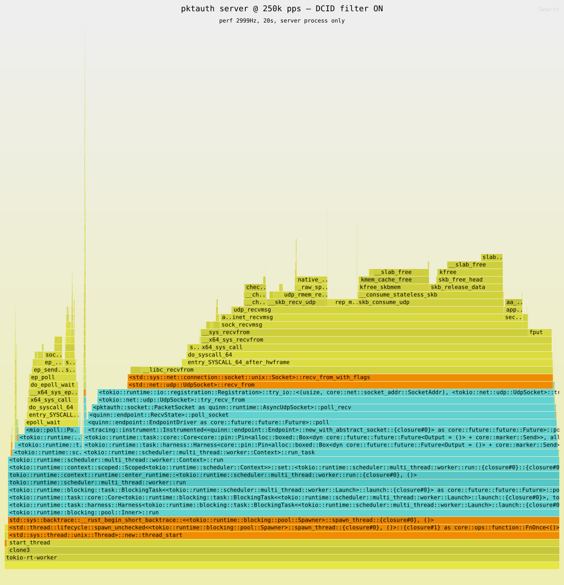
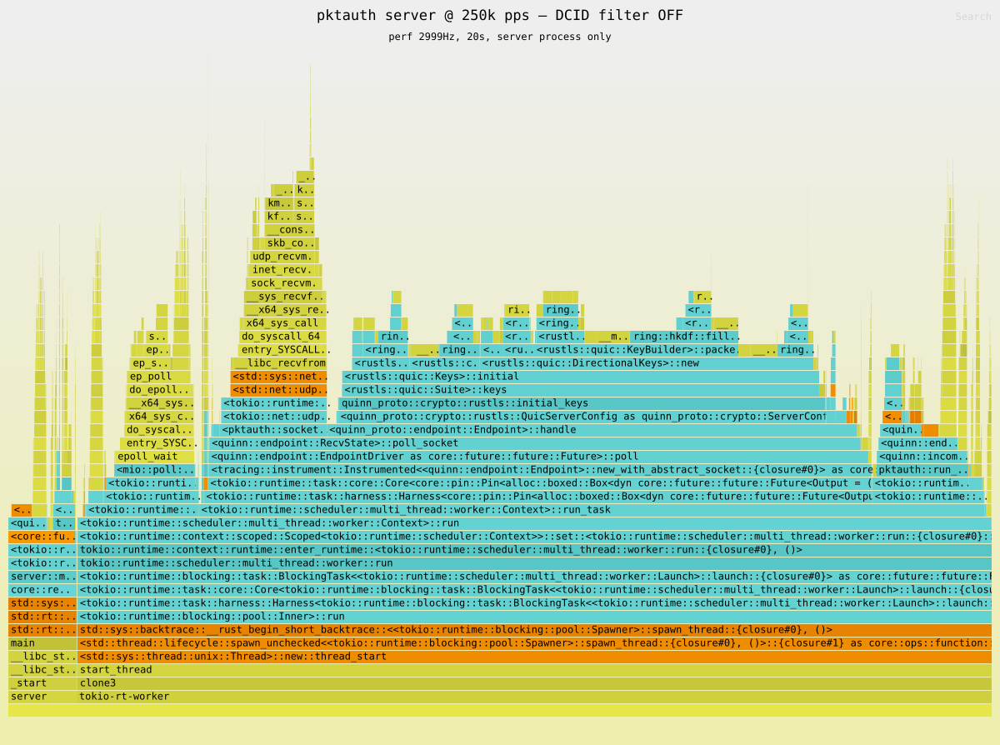

# pktauth

A proof of concept for **QUIC packet authentication**: every connection ID this
endpoint hands out carries a keyed tag, and arriving datagrams are checked
against that tag at the socket — before Quinn is allowed to parse them.

The point is to keep an unauthenticated flood away from the QUIC state machine.
A QUIC server that parses whatever arrives will happily start a TLS handshake for
a random Initial packet, and that handshake costs far more than the packet cost
to send. Checking a 10-byte tag first turns that asymmetry around.

The [benchmarks](#benchmarks) below measure it. With the filter on, this server
absorbs **500k unauthenticated packets/s on 0.35 of a core** while still
answering pings in **0.17 ms**. With the filter off, the same load costs **1.17
cores** and ping latency degrades to **14.6 ms** — because 29% of the server's
CPU goes into ring, deriving keys for garbage.

## How it works

A connection ID is 20 bytes, which is the maximum QUIC allows, and all 20 are
used ([`src/auth.rs`](src/auth.rs)):

```
 0        2                        10                          20
 +--------+------------------------+---------------------------+
 | selec- |         nonce          |   Trunc80(AES-128 tag)    |
 |  tor   |                        |                           |
 +--------+------------------------+---------------------------+
   2 bytes         8 bytes                   10 bytes
```

The tag is one AES-128 block over `nonce || src_ipv4 || dst_ipv4` — 8 + 4 + 4 =
exactly 16 bytes — so verification is a single block encryption and a 10-byte
compare. The selector picks the direction key (`F_AB` for client→server, `F_BA`
for server→client), which is why a token minted for one direction cannot be
replayed in the other.

Because both addresses are authenticated, a token is only valid on the path it
was issued for. That is also why the server must bind a concrete IPv4 address
rather than a wildcard, and why the client has a `--local-ip` flag.

Verification happens in [`src/socket.rs`](src/socket.rs), inside a hand-rolled
`AsyncUdpSocket` that Quinn does all its I/O through. A datagram that fails the
check is counted and dropped, and its receive slot is reused — Quinn never learns
the packet existed.

> **This is a proof of concept.** The two keys are compile-time constants in
> [`src/auth.rs`](src/auth.rs) and are explicitly not secret. There is no key
> rotation, no replay window, and no nonce tracking. Do not deploy it.

### Layout

| Path | What it is |
|---|---|
| [`src/auth.rs`](src/auth.rs) | Token format, tag computation, `Authenticator`, Quinn CID generator |
| [`src/socket.rs`](src/socket.rs) | `AsyncUdpSocket` implementation where every datagram is checked |
| [`src/lib.rs`](src/lib.rs) | Endpoint setup and the ping/echo protocol |
| [`src/bin/server.rs`](src/bin/server.rs) | Echo server |
| [`src/bin/client.rs`](src/bin/client.rs) | Ping client, reports RTT |
| [`src/bin/blaster.rs`](src/bin/blaster.rs) | Flood generator: QUIC Initials with random connection IDs |
| [`tests/echo.rs`](tests/echo.rs) | Integration tests, including that forged packets never reach Quinn |
| [`scripts/`](scripts/) | The benchmark harnesses behind the numbers below |

## Build

```sh
cargo build --release
cargo test --release      # 25 tests
```

## Running it

The server generates a self-signed certificate on startup and writes it where the
client can pin it:

```sh
# terminal 1
./target/release/server --listen 127.0.0.1:4433

# terminal 2
./target/release/client --server 127.0.0.1:4433 --count 10
```

Both print UDP-level counters on exit, including how many datagrams were rejected
as unauthenticated.

To measure what the filter is worth, run the server with `--no-dcid-validation`.
It still *issues* authenticated connection IDs; it just stops checking the ones
that arrive.

### The blaster

`blaster` floods a target with QUIC Initial packets whose destination connection
IDs are random, so none carry a valid tag and all should be rejected. Everything
except the connection ID is built once at startup, so each packet costs one `send`
plus 20 bytes of PRNG output.

```sh
./target/release/blaster --target 127.0.0.1:4433 \
    --threads 20 \        # sender threads, each with its own socket
    --pps 250000 \        # rate across all threads; 0 = unpaced
    --duration 10 \
    --size 1200           # datagram size; 1200 is the RFC 9000 minimum
```

Point it only at endpoints you operate.

## Benchmarks

Everything below comes from the scripts in [`scripts/`](scripts/):

```sh
scripts/bench-threads.sh              # blaster thread scaling
scripts/bench-cpu.sh on  250000       # server CPU + client RTT at one rate
scripts/bench-cpu.sh off 250000
scripts/flamegraph.sh on  250000      # writes docs/flamegraph-dcid-on.svg
scripts/flamegraph.sh off 250000
```

Machine: AMD EPYC 9275F, 24 cores / 48 threads, Linux 6.8.0-85, rustc 1.97.0,
loopback, 1200-byte datagrams.

### Methodology

**Everything is pinned to disjoint cores** — server on 0–3, client on 4–5, blaster
on 8–47. Without this the blaster steals CPU from the server it is aimed at and
the server's CPU figure stops being its own cost. It changes conclusions:
unpinned, the unfiltered server could not complete a handshake at all above 750k
pps, but with dedicated cores it stays reachable through 500k.

**Server CPU only.** `utime + stime` deltas from `/proc/<server-pid>/stat` over
wall time, giving cores. The window opens after a 2 s settle and closes when the
client finishes its 400 pings — 4.5 s in the healthy cases — so the CPU and
latency columns describe the same interval. At 100k pps that is ~450k packets per
sample; the 10 ms clock-tick quantum puts roughly ±5% on the smallest readings.

**Packet loss is not the metric.** `net.core.rmem_default` is 128 MB here, so the
loopback socket absorbs any burst. Client and server UDP counters matched exactly
in every run and all 400 pings were echoed in all 30 runs of the comparison —
**zero loss everywhere**. An unfiltered flood shows up as CPU and latency, not as
drops, so that is what is reported.

**The blaster's own rate counter lies once the receiver falls behind.** A loopback
`send()` into a full receive queue is *cheaper* than a real delivery — the packet
is dropped at enqueue — so the tool's reported rate climbs while almost nothing
arrives. Unpinned at 192 threads it claimed 17.1M pps with 97.6% never delivered.
The `delivered pps` column below is the rate the kernel actually delivered
(`/proc/net/snmp` `InDatagrams`), not the rate the blaster claimed.

### 1. Filter on vs. off: CPU and latency

Mean of 3 runs per point. Blaster on 8 threads, `--pps` paced. Client sends 400
pings at 10 ms intervals across the measurement window. All 30 runs connected
successfully and echoed all 400 pings.

| offered pps | filter | server cores | µs CPU/pkt | delivered pps | rtt min | **rtt avg** | rtt max |
|---|---|---|---|---|---|---|---|
| 100k | **on** | 0.078 | 0.78 | 100.2k | 0.022 ms | **0.063 ms** | 0.4 ms |
| 100k | off | 0.421 | 4.20 | 100.2k | 0.033 ms | **0.184 ms** | 1.4 ms |
| 200k | **on** | 0.145 | 0.72 | 200.4k | 0.023 ms | **0.069 ms** | 0.4 ms |
| 200k | off | 0.819 | 4.09 | 200.3k | 0.029 ms | **0.424 ms** | 1.1 ms |
| 300k | **on** | 0.213 | 0.71 | 300.3k | 0.020 ms | **0.055 ms** | 0.4 ms |
| 300k | off | 1.147 | 3.81 | 300.7k | 0.034 ms | **4.42 ms** | 110 ms |
| 400k | **on** | 0.290 | 0.72 | 400.7k | 0.020 ms | **0.084 ms** | 0.4 ms |
| 400k | off | 1.150 | 2.90 | 396.5k | 0.035 ms | **8.30 ms** | 979 ms |
| 500k | **on** | 0.347 | 0.69 | 500.7k | 0.042 ms | **0.171 ms** | 0.7 ms |
| 500k | off | 1.171 | 2.49 | 470.6k | 0.043 ms | **14.58 ms** | 1212 ms |

Off/on ratios — CPU: 5.4× / 5.7× / 5.4× / 4.0× / 3.4×.
Average RTT: 3× / 6× / **81×** / **98×** / **85×**.

**Per-packet cost is flat with the filter on:** 0.69–0.78 µs per rejected packet
across the whole range, so CPU scales linearly with offered load. With the filter
off the honest figure is **~4.15 µs/packet**, taken at 100k and 200k where the
server still keeps up. The filter is **~5.5× cheaper per packet**.

**The ratio shrinking above 200k is the unfiltered server hitting a wall, not the
filter mattering less.** Cores pin at ~1.15 from 300k on, and that ceiling is
structural: Quinn drives `poll_recv` from a single task, so the receive path is
one core's worth of work however many cores the process is given. Filtered, at
0.7 µs/packet, that one core is worth ~1.7M pps; unfiltered, at ~4 µs/packet, it
runs out near **470k pps**. The apparent drop in µs/packet past that point is load
being clipped, not efficiency.

**Latency is where it breaks.** Below saturation the penalty is modest — 3–6× on a
sub-millisecond baseline. Once the server cannot drain the socket, the queue backs
up and average ping latency crosses into milliseconds, with worst-case round trips
of 110 ms, 979 ms and 1.2 s. The filtered server is still answering in 0.17 ms
while rejecting half a million packets a second.

### 2. Flamegraphs

Server process only, 20 s at `perf -F 2999`, under a 250k pps blast with a client
pinging throughout. Both profiles took in ~6.05M datagrams. The SVGs are
interactive — click to zoom, Ctrl-F to search — if you open the files directly;
GitHub renders them flat.

**DCID filter ON** — [`docs/flamegraph-dcid-on.svg`](docs/flamegraph-dcid-on.svg)



**DCID filter OFF** — [`docs/flamegraph-dcid-off.svg`](docs/flamegraph-dcid-off.svg)



Same offered load, **16.4G cycles filtered against 99.5G unfiltered** — a 6.1×
gap, consistent with the 5.4–5.7× CPU ratio measured independently above.

Self time by leaf symbol:

| | filter ON | filter OFF |
|---|---|---|
| TLS crypto: SHA-256, HKDF, AES-GCM (ring) | 0.03% | **28.99%** |
| bulk copies (`memmove`/`rep_movs`) | 4.47% | **23.66%** |
| slab / malloc / free | 24.82% | 8.23% |
| kernel UDP receive path | **19.44%** | 2.31% |
| tokio + epoll | 9.56% | 5.84% |
| `quinn_proto` | 0.13% | 2.98% |
| lock contention (spin) | 7.37% | 0.90% |
| **the tag check itself** | **0.02%** | — |
| unattributed | 34.17% | 27.07% |
| **total** | **16.4G cycles** | **99.5G cycles** |

Two things stand out.

**With the filter on, the cost is the syscall, not the cryptography.** The hot
leaves are `__slab_free` (16.2%), `__libc_recvfrom` (7.3%),
`native_queued_spin_lock_slowpath` (5.9%), `fput` (4.3%), `rep_movs_alternative`
(4.3%) — all kernel `recvfrom` machinery. The tag check does not appear as a
distinguishable cost: it is inlined into `PacketSocket::poll_recv`, and every
stack mentioning `pktauth::auth` or an AES symbol totals 0.003G of 16.4G cycles.
One AES block per packet is simply cheap next to reading the packet off the
socket. So the way to make this server faster is `recvmmsg` and GRO, not a cheaper
tag.

**With the filter off, the server does TLS for the attacker.** The hot leaves are
`__memmove_avx512_unaligned_erms` (15.6%), `sha256_block_data_order_hw` (10.1%),
`ring::hkdf::fill_okm` (6.1%) and `Mutex::lock_contended` (3.7%) — HKDF key
schedules, digest work, and contention between handshake tasks on shared endpoint
state. That is the asymmetry the filter closes: 1200 bytes and one `send` from the
attacker, a key derivation from the server.
